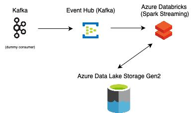

# :green_book: Home Assigment (Data Engineering case study :beginner:)

This repository contains a soluton for **some** company `Assignment - Enterprise-Ready Data Platform`. I have a next task description, limitantions, and requirements.

---
#### Design a cloud-based data platform that provides data to the following:
- Decision Services that provide risk assessment during the customer journey to checkout
- Data Scientists that need to understand and discover attributes to train the models for fraud model
- Analysts that need current and historical data for reporting and dashboard to respond to historical fraud cases
Since the decision services are a critical part of the customer journey, the provision of data must be considered mission-critical.
An additional consideration is that, by expanding in different markets, Billie’s business logic and data are subject to changes that must be faced in the least time possible. Consider such a scenario and describe/design a solution to mitigate potential issues

#### Boundaries:
- The solution must consider budget/capacity constraints
- You can choose any cloud vendor/solution given the above considerations
- Chose a technology which you would be confident to code on
- The design can be presented in any format as long as it clearly exposes the solution
- We want a real-time solution

#### Requirements:
- Data for the decision Service must be free from duplicates and irregular values
- Data for the decision Services have to be enriched with data from slow-changing dimensions sources
- No data shall be lost in case of disaster
---

#### My opinion and Solution
Since I work mostly with historical data using `Python`, `Spark`, and `Azure` and `Kafka`, `HDFS`. That would be hard, since it's my first experience to work with Spark Streaming and Real Time processing.
So after analysing the given requirements I have create next plan to implement it till 23.09.2024 :warning:

#### Shortly

- In [kafka](./kafka/) folder i used a code to send data to `Azure`
- in the [notebook](./notebooks/risk-assesment-notebook.ipynb) - main code of Spark transformations etc

#### High level of architecture

-  First step would be: Use `Kafka`(`Event Hub`) to store all incomming json data. It's good to store it temporary, so we can collect data and process it later. The example of json I put in [data](./data/) folder  
-  In `Azure Databricks` part I receive data from Kafka and start process by micro-batches (Spark Streaming is less effective than Flink, but i know Spark API at least)
-  As for storage I will use Azure Data Lake Storage Gen2 (Databricks uses it by default to store delta tables in the Datbricks cluster) with mix of SCD Type 1 and Type 2. 

##### Observation
Since my task is risk assesment - the most important data should have history for Data Scientists model for their ML networks. I decided to use 
- Slow Change Dimension Type 2 (`credit_rating`, `total_cost`, `risk_score`, `risk_level`, and `approval_status`) for important data
- Slow Change Dimension Type 1 for not important one (`name`, `email`, `contact person`, `address` etc)

